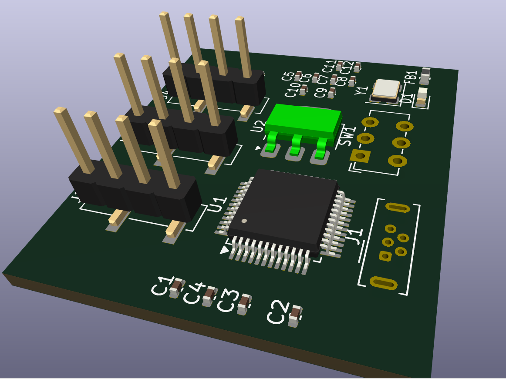
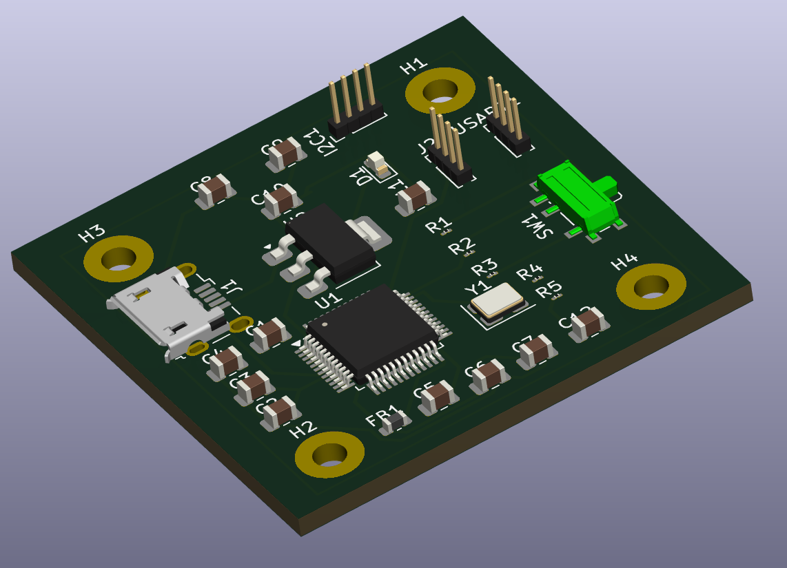
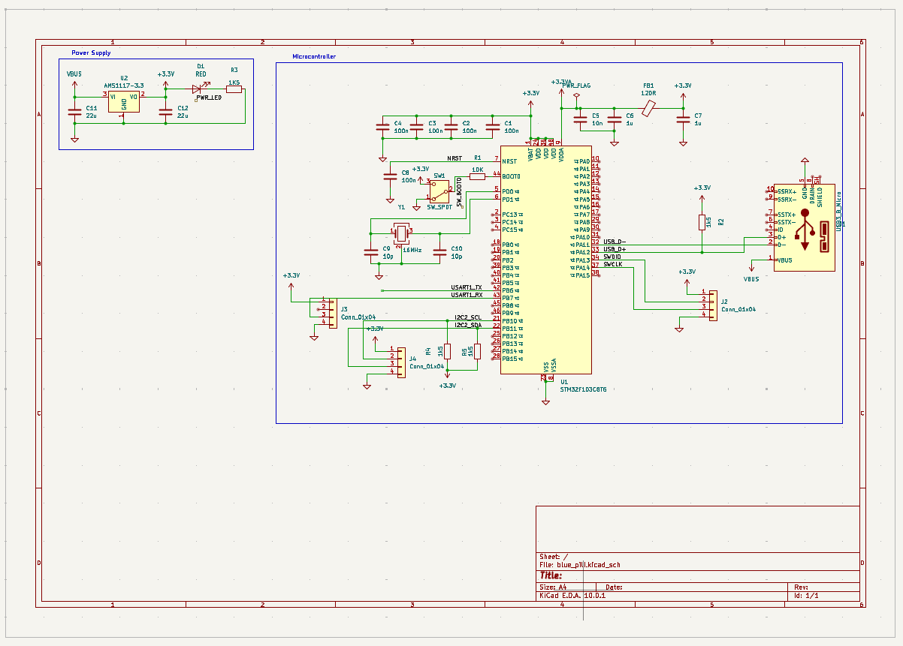

# STM32 Custom PCB — Personal Learning Project

> A custom PCB designed around the STM32 microcontroller family, built as a hands-on dive into embedded hardware design, schematic capture, and PCB layout from scratch.

---

## 📸 Board Overview

| Top View | Bottom View |
|----------|-------------|
|  |  |

### 3D Preview


---

## 🎯 Project Goals

This board was designed as a personal learning exercise to bridge the gap between working with off-the-shelf development boards (like Nucleo or Blue Pill) and understanding what it actually takes to design production-ready hardware. The key goals were:

- Design a minimal STM32 circuit from the ground up — no dev board shortcuts
- Understand the full flow: schematic → layout → Gerber → fabrication
- Get comfortable with decoupling strategies, power plane design, and signal routing
- Build something I could actually program and debug with a standard SWD debugger

---

## 🧠 Microcontroller Choice

**STM32F103C8T6** (or your specific variant)

The STM32F103 was chosen for several reasons:

- **Widely documented** — enormous community, ST's own HAL/LL libraries, and CubeMX support made it ideal for learning without fighting toolchain issues
- **Affordable** — cheap enough to order multiples without worry
- **Capable peripherals** — SPI, I2C, USART, USB, timers, and ADC all in one package covers most beginner-to-intermediate use cases
- **LQFP48 package** — hand-solderable under magnification, a good balance between accessibility and pin count

---

## 📐 Schematic Design

### Schematic Overview



### Power Supply

The board is powered via USB (5 V) stepped down to 3.3 V using an **AMS1117-3.3** LDO regulator. Design decisions:

- **Input capacitor:** 10 µF electrolytic + 100 nF ceramic in parallel at regulator input to handle transient load steps
- **Output capacitor:** 10 µF electrolytic + 100 nF ceramic at regulator output for stability — the AMS1117 requires at least 10 µF on the output per its datasheet
- Power LED with a 1 kΩ current-limiting resistor as a basic "board is alive" indicator

### Decoupling Strategy

Every VDD pin on the STM32 has its own **100 nF ceramic decoupling capacitor** placed as close to the pin as physically possible. The VDDA analog supply additionally gets a **1 µF** capacitor to further filter noise from the digital domain. This follows ST's recommended layout from AN4661.

### Reset Circuit

A simple RC reset circuit (10 kΩ pull-up + 100 nF to GND) with a push-button to pull NRST low manually. This keeps the reset pin stable at startup and prevents false resets from noise.

### Boot Configuration

BOOT0 is tied to GND via a 10 kΩ resistor (normal flash boot mode) with a jumper header so the pin can be pulled high to enter the built-in bootloader over USART1. This was a deliberate design choice to allow firmware flashing without a dedicated SWD programmer if needed.

### SWD Debug Header

A standard 4-pin SWD header (SWDIO, SWDCLK, 3.3 V, GND) is exposed for programming and debugging with an ST-Link. This is the primary way the board is flashed — no USB DFU or serial bootloader required for normal use.

---

## 🖥️ PCB Layout

### Layer Stackup

2-layer board (standard FR4, 1.6 mm, 1 oz copper):

| Layer | Purpose |
|-------|---------|
| Top | Signal routing + components |
| Bottom | Ground plane (poured) |

A solid ground plane on the bottom layer was a conscious decision to reduce loop inductance for decoupling capacitors and keep return currents well-defined — especially important around the analog supply pins.

### Layout Screenshots


### Routing Notes

- **Decoupling caps** are placed on the same side as the MCU, between the power pin and the via to the ground plane
- **Crystal** (if present) is kept close to the MCU with guard ring and short, matched-length traces
- **USB data lines** (D+/D−) are routed as a differential pair with matched lengths and 90 Ω differential impedance targeted (approximate on a 2-layer board)
- **Power traces** are wider than signal traces: 0.5 mm for 3.3 V rails vs 0.25 mm for signal lines

---

## 🔌 Connectors & Pinout

| Connector | Function |
|-----------|----------|
| USB Micro-B | Power input + USB peripheral |
| SWD 4-pin | Programming / debugging |
| BOOT0 Jumper | Bootloader / flash mode select |
| GPIO Headers | Breakout of remaining MCU pins |

---

## 🛠️ Manufacturing

- **Fabrication:** JLCPCB (2-layer, FR4, HASL finish, 5 pcs)
- **Assembly:** Hand-soldered with a fine-tip iron and hot air station for the LQFP48 QFP package
- **Stencil:** Ordered for paste application on the SMD passives

---

## 📦 Bill of Materials (Key Components)

| Reference | Component | Value / Part | Package |
|-----------|-----------|--------------|---------|
| U1 | STM32F103C8T6 | MCU | LQFP48 |
| U2 | AMS1117-3.3 | LDO Regulator | SOT-223 |
| C1–C8 | MLCC Capacitor | 100 nF, 50 V | 0402 |
| C9, C10 | Electrolytic | 10 µF, 16 V | SMD |
| R1 | Resistor | 10 kΩ | 0402 |
| R2 | Resistor | 1 kΩ | 0402 |
| LED1 | Power LED | Green | 0402 |
| SW1 | Reset Button | Tactile | 3×4 mm SMD |
| J1 | USB Connector | Micro-B | SMD |
| J2 | SWD Header | 4-pin | 2.54 mm THT |

---

## 💡 Key Learnings

- **Datasheet discipline** — Reading AN4661 (STM32 hardware development guidelines) before touching the layout saved a lot of rework. Things like bypass cap placement and VDDA filtering aren't optional.
- **Ground plane value** — Even on a budget 2-layer board, a solid ground plane makes a measurable difference in signal integrity and makes the board behave more predictably.
- **Package selection matters** — LQFP48 is right on the edge of hand-solderability. QFN would have been harder; TQFP100 would have added unnecessary complexity for a learning board.
- **Always add test points** — I added them on 3.3 V, GND, SWDIO, and SWDCLK. They are invaluable during bring-up.

---

## 🚀 What's Next

- Add an onboard ST-Link debug circuit so the board is self-contained
- Explore the STM32G0 series for a lower-power revision
- Design a shield/expansion board for specific peripheral experiments (SPI display, LoRa module)

---

## 📁 Repository Structure

```
├── hardware/
│   ├── schematic.pdf
│   ├── gerbers/
│   └── bom.csv
├── images/
│   ├── schematic.png
│   ├── pcb_top.png
│   ├── pcb_bottom.png
│   ├── layout_top.png
│   ├── layout_bottom.png
│   └── 3d_view.gif
└── README.md
```

---

## 🛡️ License

This project is open hardware — schematics, layout, and documentation are released under the [CERN Open Hardware Licence v2 - Permissive](https://ohwr.org/cern_ohl_p_v2.txt).

---

*Designed with KiCad 7 · Fabricated by JLCPCB · Hand-assembled*
